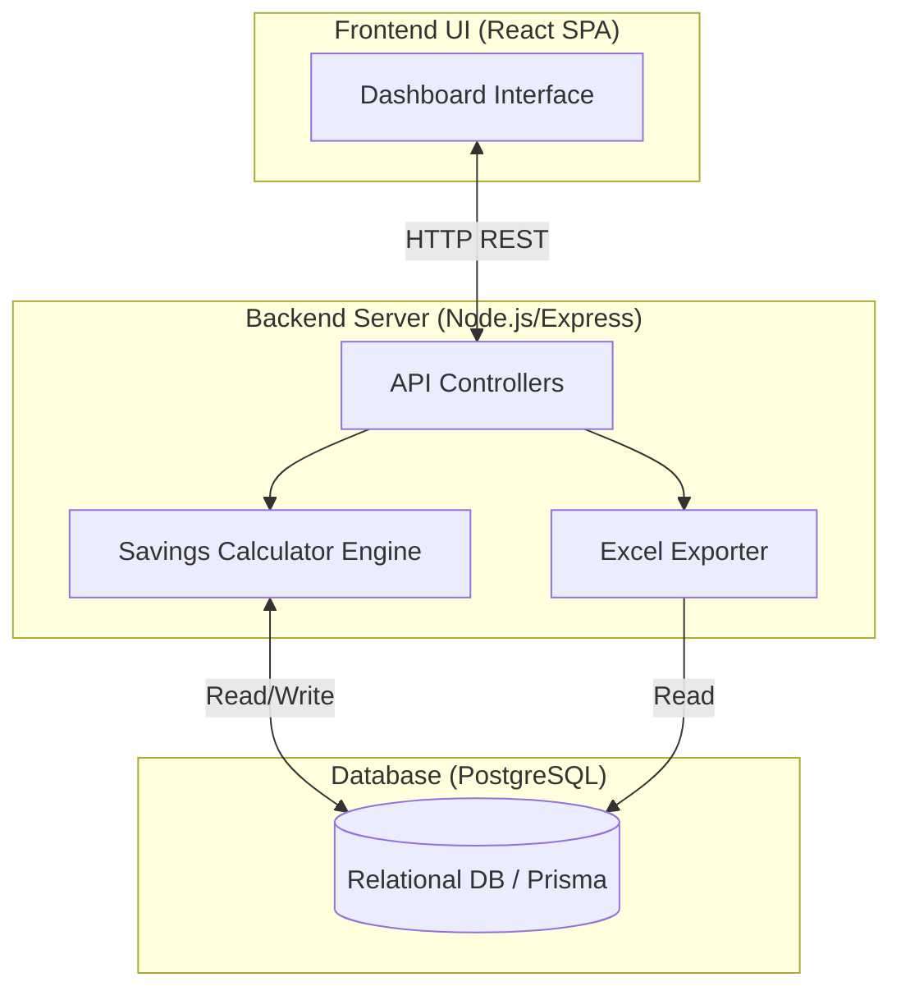
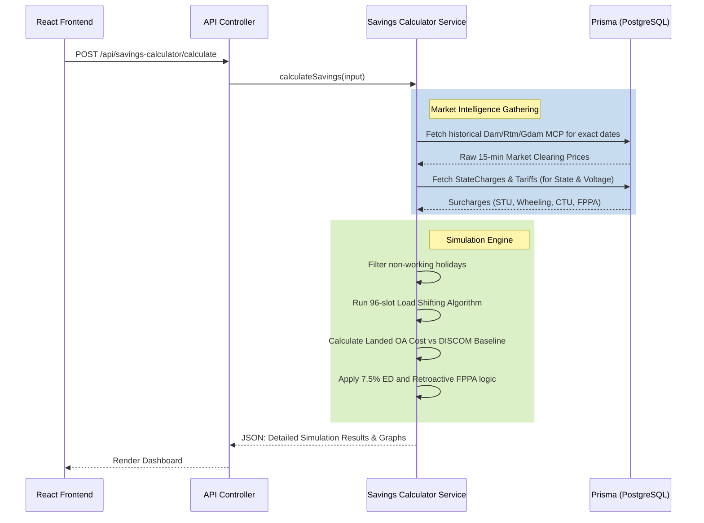
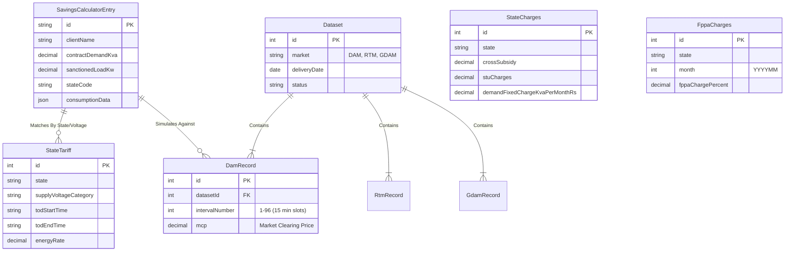
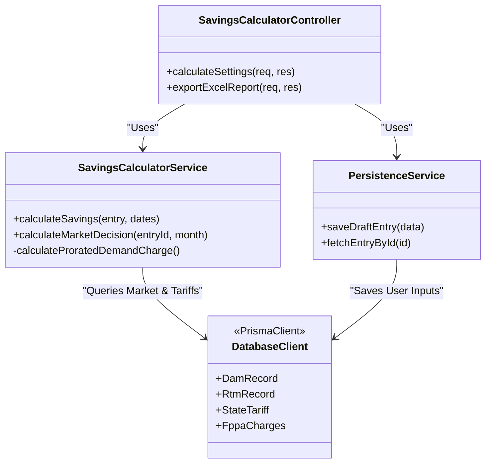

# iex-dashboard

# IEX-Dashboard Architecture Design

Below are the High-Level Design (HLD) and Low-Level Design (LLD) diagrams for the IEX-Dashboard project. 

## 1. High-Level Design (HLD)
The HLD outlines the overall system architecture, demonstrating how the frontend, backend, database, and external clients interact with one another.

## 2. Component Interaction Flow (HLD)
A deeper look into the exact request flow when a user runs a Savings Calculation simulation.

## 3. Low-Level Design (LLD) - Database ERD
The Low-Level Design highlights the relational database schema, which tracks time-series market data, regional tariff regulations, and user inputs.

## 4. Class / Module Design (LLD)
A look at the backend modular architecture.

